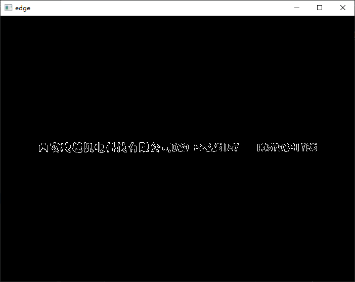

# 基于opencv + python的激光线交点坐标提取

> 环境：
>
> Pycharm
>
> python3.9
>
> opencv4.5.4  
>
> 此文章只描述技术思路，不讲解相关原理                                                                                                                                                                                                                                                                                                                                                                                                                                                                                                                                                                                                                                                                                                                                                                                                                                                                                                                                                                                                                                                                                                                                                                                                                                                                                                                                                                                                                                                                                                                                                                                                                                                                                                                                                                                                                                                                                                                                                                                                                                                                                                                                                                                                                                                                                                                                                                                                                                                                                                                                                                                                                                                                                                                                                                                                                                                                                                                                                                                                                                                                                                                                                                                                                                                                                                                                                                                                                                                                                                                                                                                                                                                                                                                                                                                                                                                                                                                                                                                                                                                                                                                                                                                                                                                                                                                                                                                                                                                                                                                                                                                                                                                                                                                                                                                                                                                                                                                                                                                                                                                                                                                                                                                                                                                                                                                                                                                                                                                                                                                                                                                                                                                                                                                                                                                                                                                                                                                                                                                                                                                                                                                                                                                                                                                                                                                                                                                                                                                                                                                                                                                                                                                                                                                                                                                                                                                                                                                                                                                        

## 问题描述

从如下图像中提取激光交点的坐标：

## 解决

​	我们要提取的是激光线交点的坐标，首先要找到激光线，通过直线的方程即可得到激光线的交点。

### 提取直线之前的预处理

1. 根据激光线的颜色来提取激光线，激光线都是单色的，可以从RGB或者HSV模型中提取出单一颜色（一般来说，是在HSV模型中提取），即可得到只含有中心线的图片， 这种方法每次都需要调整要查找的颜色，颜色范围选取的好坏直接决定了处理效果的好坏（这种做法，我没有做出来）
2. 通过传统的，滤波、二值化、腐蚀、膨胀操作，来获得较为干净的图片。这种做法可以处理第一章图像，但，在第二张图像转换为灰度图后，由于文字的灰度和激光线的灰度差不多，在二值化时会无法消除文字的影响，进而后续的hough变换中会影响直线的识别，效果不是很好
3. 使用Canny边缘检测作为二值化的方法，需要调整的参数少，二值化的效果也比较好，但仍然无法消除文字对图像的影响

以上是寻找直线之前的预处理，在预处理中，还是没有克服文字对激光线的影响，在文字影响小的情况下，使用Canny检测可以有效的获得二值化的图像，对于文字对识别影响较大的图片，需要对文字另做处理

#### 文字消除

对图二做边缘检测后，得到如下图像

可以看到文字会对直线的识别造成影响，分析文字和激光线，文字是弯曲的，激光线大致只有两个方向，沿x轴方向或者沿y轴方向，有倾斜，但没有弯曲，这时可以考虑使用Sobel算子对图像进行处理，但实际操作中，Sobel也会提取文字的一部分，使文字产生缺失，后续的膨胀效果不好。

对文字的处理，最后是在滤波中处理的，使用高斯滤波，选取较大的核即将直线滤除掉得到只有文字的图片

通过对只含有文字的图片进行膨胀操作（注意：opencv中膨胀操作默认是对黑色部分进行膨胀，这里我们希望对白色部分进行膨胀，所以使用的是腐蚀的函数），得到文字区域

得到腐蚀后的图片后我们将两长图片进行比较，在原图像中， 将文字区域的像素全部设置为0（黑色）即可，消除文字的影响

### 提取直线

一般采用Hough变换（霍夫变换）来提取直线

### 提取交点坐标

这里用两种提取交点坐标的方法

1. 通过直线方程获得，检测到的直线可能会有多根，可以将同一方向上的直线进行合并，最后只剩下两个方向上的两条直线计算交点

2. 通过角点检测来获得坐标，在一张空白的图像上，根据直线方程获得只含有直线的图像，然后检测图像的角点，选取前4个角点坐标，进行平均，即可得到中心点坐标

   

通过四个角点（红色），来逼近真正的交点（绿色）

